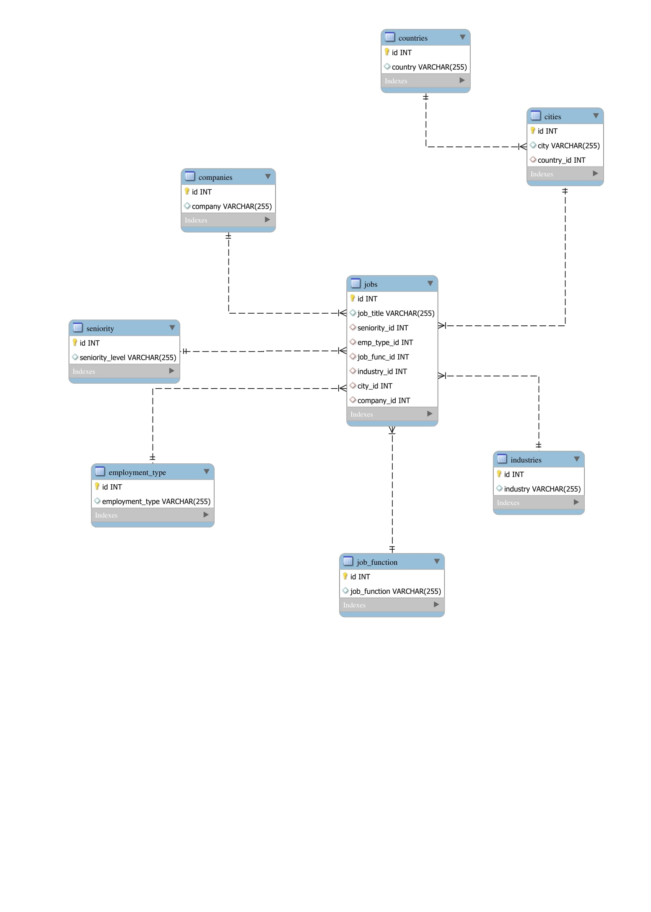

### Linkedin Jobs Scraper
#### Made by Aviv Tahar and Evgeny Oyffe 
This project automatically opens a web driver and collects information from a 
linkdin job list defined by the user. The program inserts the job listings
to a predefined MySQL server.

How to use:
1. This program assumes the user has a MySQL server installed.
2. Type python main.py [serch_query] [username] [password] [ip] [key] on your terminal
to activate the scraper. 
Example: python main.py 'data scientist in beer sheva' root myPassword 127.0.0.1 4306112a3088c5b24c4708e9915ccc2b

use MySQL server's username, password and ip as the arguments on your local 
Terminal. This will create, if db is not already created, the web scrapper db.

the key parameter is for using the positionstack.com API.
the program will fetch the coordinates of job locations and store it in the DB

The given example is supposed to perform a simple short demonstration.

The scraper will run the search query on google for a linkedin job list on 
chrome incognito mode, it will scrape the different job listings it found and
insert it into the database.

PREREQUISITES: 
1. Download and install chromedriver before running this project
by following the setup on this link: 
https://chromedriver.chromium.org/getting-started

2. Install requirements `pip install -r /path/to/requirements.txt`

Remote repo:  https://github.com/AvivTahar/DataScrapingProject.git

DataBase Information:
The database was designed to accept the different job listings and keep track
of the jobs, companies, cities, countries, seniority level, employment type,
job functions and industries

Most tables except jobs and cities are short tables with a few specific possible
entries. 
cities table holds the current information of location of jobs and a foreign key
to the countries table. The cities are unique in such way that a unique city
also is specific for a country. For Example: Moscow, Russia and Moscow, USA 
are unique cities.
jobs table is the major table of our database and holds unique job entries 
with information relating it (Foreign Keys) to the other tables. 

Entity Relation Diagram (ERD):
img